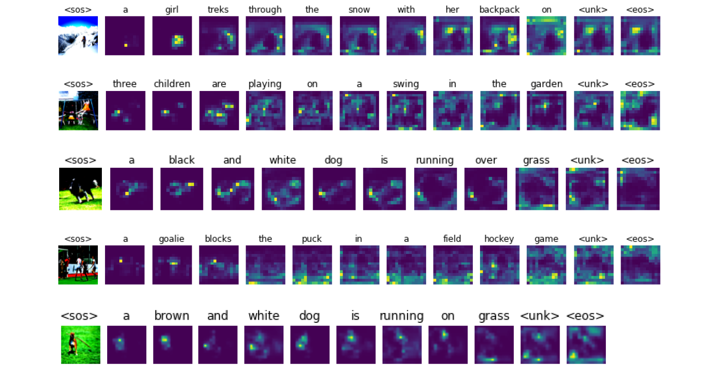
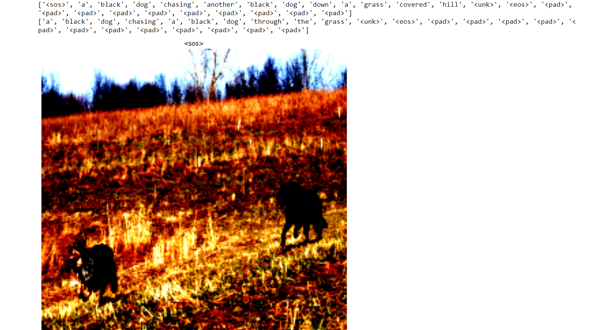

# Image-Caption-Generation-using-Attention-Networks

---

## Outline
1. [About the Project](#about-the-project)
    * [Problem Statement](#problem-statement)
    * [Working](#working)
      * [Encoder](#encoder)
      * [Decoder](#decoder)  
    * [Model Hyperparameters](#model-hyperparameters)
    * [Dataset](#dataset) 
2. [Results](#results)
    * [BLEU Scores](#bleu-scores)
    * [Meteor Scores](#meteor-scores)
    * [Attention Weights](#attention-weights)
    * [Sample Output](#sample-output)

---

## About the Project
### Problem Statement
Automatically generating captions of an image is a task very close to the heart of scene understanding — one of the primary goals of computer vision. Not only must caption generation models be powerful enough to solve the computer vision challenges of determining which objects are in an image, but they must also be capable of capturing and expressing their relationships in a natural language. For this reason, caption generation has long been viewed as a difficult problem. It is a very important challenge for machine learning algorithms, as it amounts to mimicking the remarkable human ability to compress huge amounts of salient visual infomation into descriptive language.

### Working
#### Encoder
The model model takes a single raw image and generates a caption y encoded as a sequence of 1-of-K encoded words. The project uses a convolutional neural network in order to extract a set of feature vectors which we refer to as annotation vectors. The extractor produces L vectors, each of which is a D-dimensional representation corresponding to a part of the image.  

In order to obtain a correspondence between the feature vectors and portions of the 2-D image, we extract features from a lower convolutional layer unlike previous work which instead used a fully connected layer. This allows the decoder to selectively focus on certain parts of an image by selecting a subset of all the feature vectors.

#### Decoder
For decoder an LSTM (Long Short Term Memory) network is used that produces a caption by generating one word at every time step conditioned on a context vector, the previous hidden state and the previously generated words. The implemenation is similar as [Zaremba et al](https://arxiv.org/pdf/1409.2329.pdf).   

The context vector is a dynamic representation of the relevant part of the image input at time t. We define a mechanism φ that computes context vector from the annotation vectors corresponding to the features extracted at different image locations.   

For each location, the mechanism generates a positive weight which can be interpreted either as the probability that the location is the right place to focus for producing the next word, or as the relative importance to give to the location in blending the annotation vector's together. The weight of each annotation vector is computed by an attention model for which the project uses a multilayer perceptron conditioned on the previous hidden state. The soft version of this attention mechanism was introduced by [Bahdanau et al. (2014)](https://arxiv.org/pdf/1409.0473.pdf).

### Model Hyperparameters
|Field|Value|
|--|--|
|Number of Training Epochs|130|
|Batch Size|128|
|Optimizer|Adam|
|Learning Rate|1e-4 (1st 120 epochs), 1e-6 (Last 10 epochs)|
|Doubly Stochastic Gradient Parameter Used|1|

### Dataset
[Link To Dataset used for the project](https://drive.google.com/file/d/1lbqTV-u8xmZ3eBuQ4tUSjq0mOjaIIp_P/view)

---

## Results 

### [BLEU Scores](https://aclanthology.org/P02-1040.pdf)
|Dataset|BLEU-1|BLEU-2|BLEU-3|BLEU-4|
|-------|-----|------|-------|------|
|Train| 70.33|56.97|49.85|44.98|
|Validation|53.86|31.74|19.61|11.95|
|Test|54.349|31.73|19.54|12.06|

### [Meteor Scores](https://www.cs.cmu.edu/~alavie/METEOR/)
|Dataset|Meteor Score|
|----|---|
|Train|53.899|
|Validation|31.39|
|Test|31.989|

### Attention Weights
Attention Weights|
:--------------|

### Sample Output
Sample Output|
:------------|

